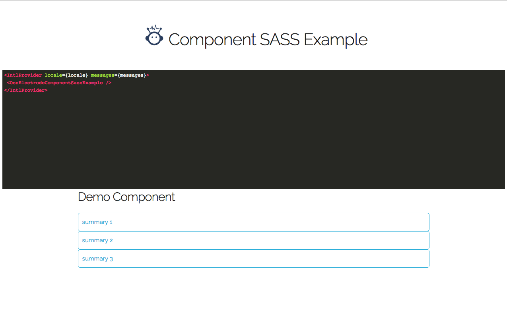

# oss-electrode-component-sass-example

Welcome to the top level of the repo for React component oss-electrode-component-sass-example.

This is designed to be a lerna repo with the following two directories:

-   `packages`
-   `demo-app`

`packages` contains the actual component modules.

`demo-app` contains an Electrode App that allows you to test and develop the components.

## Installation

To start developing, first install the lerna dependencies at the top level:

If you haven't yet, please install `fyn` to your global:
```
npm install -g fyn
```
> Note: if your `fyn` version is < 1.47, you may need to run below:
```
eval `fyn bash`
```

Install component dependencies:
```
fyn install
npm run bootstrap
```

Go to your `demo-app` folder and install dependencies:
```
fyn install
```

## Start the demo

Stays in the `demo-app` directory and run:

```
clap dev
``

Go to your browser and opens `http://localhost:3000`, you shall see the demo as below:


